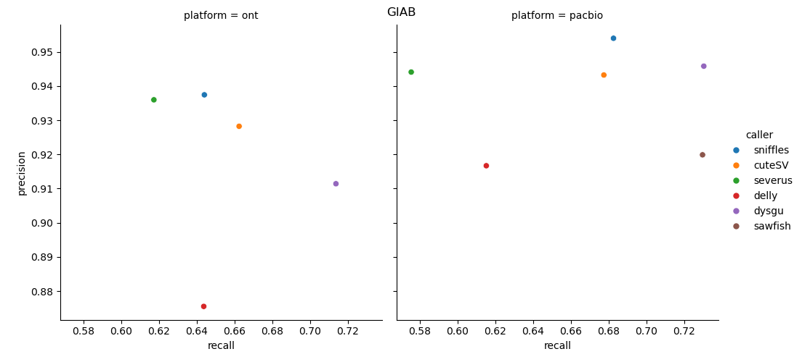
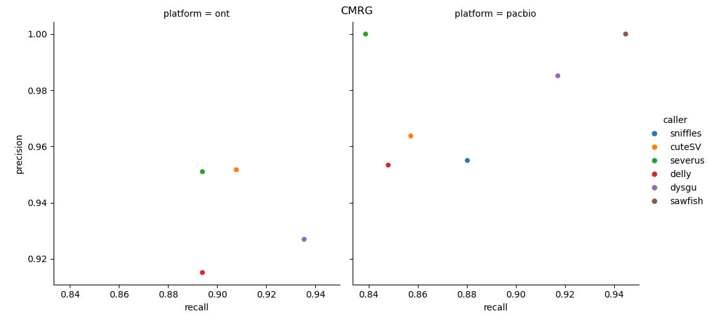

# :bar_chart: Long-read SV Benchmark CMRG/GIAB

This is a reproducible benchmark of structural variants for two benchmark datasets:

1. Challenging Medically Relevant Genes. The truth set is described in detail here:

[Curated variation benchmarks for challenging medically relevant autosomal genes. Wagner et al., 2022. Nature Biotechnology](https://www.nature.com/articles/s41587-021-01158-1)

2. The Genome In A Bottle (GIAB) truthset v1.1 is also assessed.

[GIAB](https://www.nist.gov/programs-projects/genome-bottle)

## Requirements

- Linux machine
- ~200 Gb space, 32 gb Ram, 4 cores
- [Nextflow](https://www.nextflow.io/docs/latest/install.html)

## ONT Results:

| caller   | platform   | Benchmark   |        TP |       FP |       FN |  precision |     recall |         f1 | gt_concordance |
|:---------|:-----------|:------------|----------:|---------:|---------:|-----------:|-----------:|-----------:|---------------:|
| sniffles | ont        | CMRG        |       194 |       18 |       23 |     0.9151 |      0.894 |     0.9044 |         0.8763 |
| cuteSV   | ont        | CMRG        |       197 |   **10** |       20 | **0.9517** |     0.9078 |     0.9292 |         0.8934 |
| severus  | ont        | CMRG        |       194 |   **10** |       23 |      0.951 |      0.894 |     0.9216 |         0.5722 |
| delly    | ont        | CMRG        |       194 |       18 |       23 |     0.9151 |      0.894 |     0.9044 |         0.8866 |
| dysgu    | ont        | CMRG        |   **203** |       16 |   **14** |     0.9269 | **0.9355** | **0.9312** |     **0.9015** |
| sniffles | ont        | GIAB        |     18382 |     1227 |    10164 | **0.9374** |     0.6439 |     0.7635 |              - |
| cuteSV   | ont        | GIAB        |     19101 |     1477 |     9738 |     0.9282 |     0.6623 |     0.7731 |              - |
| severus  | ont        | GIAB        |     17101 | **1170** |    10605 |      0.936 |     0.6172 |     0.7439 |              - |
| delly    | ont        | GIAB        |     17695 |     2516 |     9798 |     0.8755 |     0.6436 |     0.7419 |              - |
| dysgu    | ont        | GIAB        | **20370** |     1980 | **8176** |     0.9114 | **0.7136** | **0.8005** |              - |

## PacBio Results:

| caller   | platform   | Benchmark   |        TP |      FP |       FN | precision |     recall |         f1 | gt_concordance |
|:---------|:-----------|:------------|----------:|--------:|---------:|----------:|-----------:|-----------:|---------------:|
| sniffles | pacbio     | CMRG        |       191 |       9 |       26 |     0.955 |     0.8802 |     0.9161 |         0.9162 |
| cuteSV   | pacbio     | CMRG        |       186 |       7 |       31 |    0.9637 |     0.8571 |     0.9073 |         0.8871 |
| severus  | pacbio     | CMRG        |       182 |   **0** |       35 |     **1** |     0.8387 |     0.9123 |         0.5495 |
| delly    | pacbio     | CMRG        |       184 |       9 |       33 |    0.9534 |     0.8479 |     0.8976 |         0.8859 |
| sawfish  | pacbio     | CMRG        |   **205** |   **0** |       12 |     **1** | **0.9447** | **0.9716** |      **0.961** |
| dysgu    | pacbio     | CMRG        |       199 |       3 |       18 |    0.9851 |     0.9171 |     0.9499 |         0.9296 |
| sniffles | pacbio     | GIAB        |     19380 | **935** |     9014 | **0.954** |     0.6825 |     0.7957 |              - |
| cuteSV   | pacbio     | GIAB        |     19338 |    1164 |     9208 |    0.9432 |     0.6774 |     0.7885 |              - |
| severus  | pacbio     | GIAB        |     16107 |     954 |    11882 |    0.9441 |     0.5755 |     0.7151 |              - |
| delly    | pacbio     | GIAB        |     17173 |    1561 |    10741 |    0.9167 |     0.6152 |     0.7363 |              - |
| sawfish  | pacbio     | GIAB        |     20273 |    1766 | **7511** |    0.9199 |     0.7297 |     0.8138 |              - |
| dysgu    | pacbio     | GIAB        | **20895** |    1197 |     7715 |    0.9458 | **0.7303** | **0.8242** |              - |

Reads were from Oxford Nanopore kit14 (~40X coverage), and PacBio Vega HiFi (~30X coverage). SV callers tested were as follows:

- [sniffles v2.4.0](https://github.com/fritzsedlazeck/Sniffles)

- [cuteSV v2.1.1](https://github.com/tjiangHIT/cuteSV)

- [delly v1.3.1](https://github.com/dellytools/delly)

- [dysgu v1.7.0](https://github.com/kcleal/dysgu)

- [sawfish v0.12.7](https://github.com/PacificBiosciences/sawfish)

- [severus v1.2.0](https://github.com/KolmogorovLab/Severus)

For benchmarking [truvari v4.2](https://github.com/ACEnglish/truvari) was used.

Run `nextflow pipeline.nf` to repeat these results.

## Notes

Truvari refine was used on the GIAB benchmark. For the CMRG benchmark, refine was not run as most vcfs triggered errors using this step.

For Severus, a script was used to convert the BND-notation of deletions to symbolic DEL calls.
See `convert_severus.py` for details. 

Truvari parameters were:
    
    --passonly -r 1000 --dup-to-ins -p 0
    
To modify parameters, edit the nextflow.config file.

## Contributing

Happy to accept PR's to add other callers to this benchmark, so long as:
- The caller works with the input data (bam and cram files)
- The caller requires < 5 hours to process a sample, and consumes < 32 Gb memory
- The caller can be reliably installed without editing the source code
