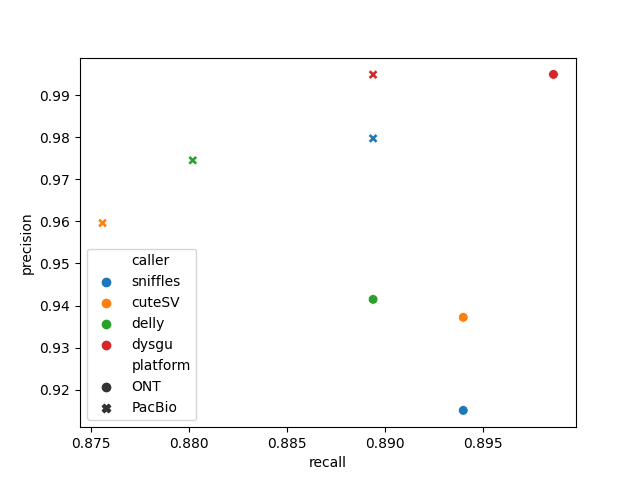

:bar_chart: Long-read SV Benchmark CMRG
=======================================

This is a reproducible benchmark of structural variants in challenging medically relevant genes. The truth set is described in detail here:

[Curated variation benchmarks for challenging medically relevant autosomal genes. Wagner et al., 2022. Nature Biotechnology](https://www.nature.com/articles/s41587-021-01158-1)




|    | caller   | platform   |   TP |   FP |   FN |   precision |   recall |     f1 |   gt_concordance |
|---:|:---------|:-----------|-----:|-----:|-----:|------------:|---------:|-------:|-----------------:|
|  0 | sniffles | ONT        |  194 |   18 |   23 |      0.9151 |   0.894  | 0.9044 |           0.8814 |
|  1 | cuteSV   | ONT        |  194 |   13 |   23 |      0.9372 |   0.894  | 0.9151 |           0.8918 |
|  2 | delly    | ONT        |  193 |   12 |   24 |      0.9415 |   0.8894 | 0.9147 |           0.8964 |
|  3 | dysgu    | ONT        |  195 |    1 |   22 |      0.9949 |   0.8986 | 0.9443 |           0.8821 |

|    | caller   | platform   |   TP |   FP |   FN |   precision |   recall |     f1 |   gt_concordance |
|---:|:---------|:-----------|-----:|-----:|-----:|------------:|---------:|-------:|-----------------:|
|  0 | sniffles | PacBio     |  193 |    4 |   24 |      0.9797 |   0.8894 | 0.9324 |           0.8912 |
|  1 | cuteSV   | PacBio     |  190 |    8 |   27 |      0.9596 |   0.8756 | 0.9157 |           0.9    |
|  2 | delly    | PacBio     |  191 |    5 |   26 |      0.9745 |   0.8802 | 0.9249 |           0.8743 |
|  3 | dysgu    | PacBio     |  193 |    1 |   24 |      0.9948 |   0.8894 | 0.9392 |           0.8808 |


Reads were from Oxford Nanopore kit14 (~40X coverage), and PacBio Revio HiFi (~30X coverage). SV callers tested were as follows:

- [sniffles v2.2.0](https://github.com/fritzsedlazeck/Sniffles)

- [cuteSV v2.0.3](https://github.com/tjiangHIT/cuteSV)

- [delly v1.1.6](https://github.com/dellytools/delly)

- [dysgu v1.6.0](https://github.com/kcleal/dysgu)


For benchmarking [truvari v4.0.0](https://github.com/ACEnglish/truvari) was used with parameters `-r 1000 --passonly`

Run the benchmark.sh script or follow along below.

### Requirements:

- ~ 200 Gb space, 32 gb Ram, 4 cores
- Docker / Singularity (Required for Mac, optional for Linux)


## Setup environment

```
mkdir benchmark && cd benchmark
docker run -it --memory="32g" --mount src="${PWD}",target=/results,type=bind condaforge/mambaforge
mamba update conda -y && cd results
```
Note, you may need to set the memory and swap space manually using Docker Desktop on Mac.

Install tools:

```
mamba create -c bioconda -c conda-forge -n bench python=3.9 awscli sniffles=2.2.0 cuteSV=2.0.3 truvari=4.0.0 delly=1.1.6 -y
conda activate bench
pip install dysgu==1.6.0
```

## Grab datasets

Reference genome:
```
wget https://ftp.ncbi.nlm.nih.gov/genomes/all/GCA/000/001/405/GCA_000001405.15_GRCh38/seqs_for_alignment_pipelines.ucsc_ids/GCA_000001405.15_GRCh38_no_alt_analysis_set.fna.gz
wget https://ftp.ncbi.nlm.nih.gov/genomes/all/GCA/000/001/405/GCA_000001405.15_GRCh38/seqs_for_alignment_pipelines.ucsc_ids/GCA_000001405.15_GRCh38_no_alt_analysis_set.fna.fai
gunzip GCA_000001405.15_GRCh38_no_alt_analysis_set.fna.gz
ref=GCA_000001405.15_GRCh38_no_alt_analysis_set.fna
```

Oxford Nanopore reads https://labs.epi2me.io/giab-2023.05/:
```
aws s3 sync --no-sign-request --include='PAO89685.pass.cram*' --exclude="*fail*" s3://ont-open-data/giab_2023.05/analysis/hg002/sup/ .
```

PacBio reads https://www.pacb.com/connect/datasets/:
```
wget https://downloads.pacbcloud.com/public/revio/2022Q4/HG002-rep1/analysis/HG002.m84011_220902_175841_s1.GRCh38.bam
wget https://downloads.pacbcloud.com/public/revio/2022Q4/HG002-rep1/analysis/HG002.m84011_220902_175841_s1.GRCh38.bam.bai
```

SV truth set:
```
r=ftp://ftp-trace.ncbi.nlm.nih.gov/giab/ftp/data/AshkenazimTrio/analysis/NIST_HG002_medical_genes_SV_benchmark_v0.01/HG002_GRCh38_difficult_medical_gene_SV_benchmark_v0.01
wget ${r}.bed && wget ${r}.vcf.gz && wget ${r}.vcf.gz.tbi
```

## Run SV callers

ONT reads:

```
sniffles --input PAO89685.pass.cram --vcf HG002.PAO89685.sniffles.vcf

dysgu run --mode nanopore --procs 4 -x --clean $ref wd PAO89685.pass.cram > HG002.PAO89685.dysgu.vcf

mkdir wd_cuteSV
cuteSV -t 4 -s 3 --genotype PAO89685.pass.cram $ref HG002.PAO89685.cuteSV.vcf wd_cuteSV

delly lr -g $ref PAO89685.pass.cram > HG002.PAO89685.delly.vcf
```

PacBio reads:
```
sniffles --input HG002.m84011_220902_175841_s1.GRCh38.bam --vcf HG002.pacbio.sniffles.vcf

dysgu call --mode pacbio --procs 4 -x --clean $ref wd HG002.m84011_220902_175841_s1.GRCh38.bam > HG002.pacbio.dysgu.vcf

mkdir wd_cuteSV
cuteSV -t 4 -s 3 --genotype HG002.m84011_220902_175841_s1.GRCh38.bam $ref HG002.pacbio.cuteSV.vcf wd_cuteSV

delly lr -g $ref  HG002.m84011_220902_175841_s1.GRCh38.bam > HG002.pacbio.delly.vcf
```


## Benchmark

ONT data:
```
callers=( "sniffles" "cuteSV" "delly" "dysgu" )

for name in "${callers[@]}"
do
  bgzip HG002.PAO89685.${name}.vcf
  tabix HG002.PAO89685.${name}.vcf.gz
  truvari bench -f GCA_000001405.15_GRCh38_no_alt_analysis_set.fna \
                -b HG002_GRCh38_difficult_medical_gene_SV_benchmark_v0.01.vcf.gz \
                --includebed HG002_GRCh38_difficult_medical_gene_SV_benchmark_v0.01.bed \
                -c HG002.PAO89685.${name}.vcf.gz \
                --passonly -r 1000 \
                -o truvari_${name}
done
```

PacBio data:
```
callers=( "sniffles" "cuteSV" "delly" "dysgu" )

for name in "${callers[@]}"
do
  bgzip HG002.pacbio.${name}.vcf
  tabix HG002.pacbio.${name}.vcf.gz
  truvari bench -f GCA_000001405.15_GRCh38_no_alt_analysis_set.fna \
                -b HG002_GRCh38_difficult_medical_gene_SV_benchmark_v0.01.vcf.gz \
                --includebed HG002_GRCh38_difficult_medical_gene_SV_benchmark_v0.01.bed \
                -c HG002.pacbio.${name}.vcf.gz \
                --passonly -r 1000 \
                -o truvari_${name}
done
```

Run the plotting script:

```python3 plot_benchmark.py```


